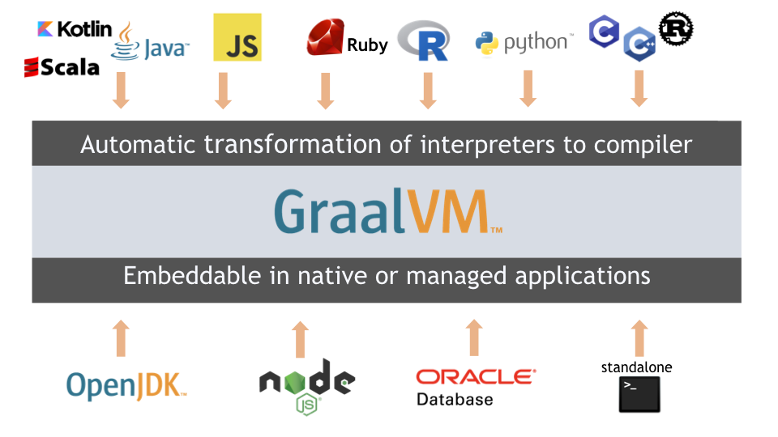
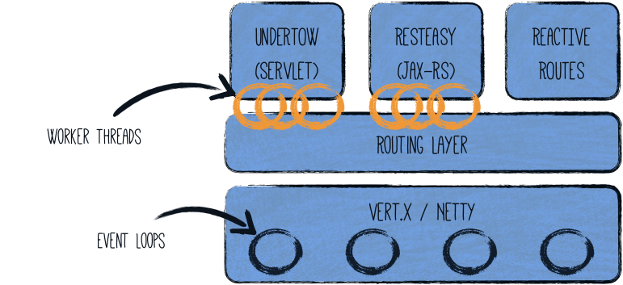

# Proyectos AOT con GraalVM (Micronaut & Quarkus)

Este repositorio contiene una demostración práctica y comparativa de frameworks Java AOT (Ahead-of-Time) diseñados para ejecutarse en entornos en la nube con un consumo mínimo de memoria y tiempos de arranque instantáneos utilizando **GraalVM**.

---

## 🛠️ Stack Tecnológico

*   **GraalVM**: Plataforma y compilador JIT/AOT.
*   **Quarkus**: Framework Java nativo de Kubernetes (incorporando Hibernate ORM con Panache y REST endpoints).
*   **Micronaut**: Framework moderno y reactivo basado en JVM para construir microservicios modulares.
*   **MySQL 5.6**: Base de datos relacional para persistencia de datos (ejecutado en Docker).
*   **Maven**: Gestor de dependencias y compilador.

---

## 🏗️ Arquitectura del Proyecto

El repositorio está dividido en dos proyectos independientes y un contenedor Docker de base de datos para simular un entorno de microservicios:

```mermaid
graph TD
    subgraph Cliente / API Consumer
        Request[Petición HTTP JSON]
    </td>
    subgraph Microservicio Quarkus
        Resource[CustomerResource /customer] --> Repository[CustomerRepository]
        Repository --> Entity[CustomerEntity]
    end
    subgraph Base de Datos
        MySQL[(MySQL Container)]
    end
    Entity --> MySQL
    Request --> Resource
```

1.  **`quarkus/`**: Prueba de Concepto (POC) funcional de una API REST de clientes (`Customer`) utilizando:
    *   **Panache Repository Pattern** para el acceso a datos de forma simple y expresiva.
    *   **Hibernate ORM** para el mapeo objeto-relacional.
    *   **Vert.x logging** integrado.
2.  **`micronaut/`**: Estructura base inicial de un microservicio Micronaut configurado para despliegues AOT.
3.  **`docker/`**: Infraestructura local con Docker Compose para levantar la base de datos MySQL requerida por el servicio.

---

# 🚀 Instalación y Uso

### 1. Requisitos Previos
*   Docker y Docker Compose.
*   Java JDK 11 (recomendado gestionar con **SDKMAN**).
*   GraalVM instalado si se desea compilar a nativo.

---

### 2. Base de Datos (Docker)
Antes de iniciar los microservicios, levante la base de datos MySQL ejecutando:

```bash
cd quarkus/src/main/docker/database
docker-compose up -d
```

> [!NOTE]
> Al arrancar, el contenedor ejecutará automáticamente el script [00-customer.sql](file:///home/vhdez/agentes/adk-github-doc/quarkus/src/main/docker/database/sql/model/00-customer.sql) que crea la tabla `customer` e inserta el cliente semilla `victor@gmail.com`.

---

### 3. Ejecutar Quarkus en Modo Desarrollo
Para arrancar el microservicio de Quarkus en modo hot-reload:

```bash
cd quarkus
./mvnw compile quarkus:dev
```

### 4. Compilar a Imagen Nativa (AOT)
Para compilar la aplicación Quarkus a un binario nativo ultra-rápido utilizando GraalVM:

```bash
cd quarkus
./mvnw package -Pnative
```

---

## 🔌 API Endpoints (Quarkus POC)

La API REST responde bajo la ruta base `/customer` y consume/produce `application/json`.

| Método | Endpoint | Descripción | Body (JSON) / Params |
| :--- | :--- | :--- | :--- |
| **GET** | `/customer/{email}` | Obtiene los detalles de un cliente registrado. | `{email}` (en ruta) |
| **POST** | `/customer/{email}` | Registra un nuevo cliente con la fecha actual de alta. | `{email}` (en ruta) |
| **DELETE**| `/customer/{email}` | Elimina a un cliente de la base de datos. | `{email}` (en ruta) |

---

# 🔬 GRAALVM & Conceptos AOT (Charla Original)



## ¿Para qué usar Graal?

Graal nos proporciona razones de peso para su uso en entornos modernos de desarrollo. Para más detalles, consulte: [¿Por qué usar GRAALVM? (10 Things)](https://medium.com/graalvm/graalvm-ten-things-12d9111f307d).

### 1. Compilador JIT (Just In Time)
Uno de los primeros pasos que se pueden hacer con Graal es usarlo como compilador Just In Time (usado en producción por empresas como Twitter).
GraalVM distribuye versiones *Community Edition* y *Enterprise Edition* basadas en OpenJDK/Oracle Java 8 y 11.

### 2. Compilador AOT (Ahead Of Time)
Disminuye el arranque lento y la huella de memoria en entornos serverless o contenedores.
Java es fuerte para procesos de larga duración (*long-running*), pero sufre en procesos efímeros (*short-running*) debido a la sobrecarga inicial. Con AOT, compilamos directamente a código nativo de la plataforma. Para más información, visite la [Documentación de Native Image](https://www.graalvm.org/reference-manual/native-image/).

### 3. Poliglotismo (Truffle Framework)
Permite combinar varios lenguajes de programación (Javascript, Java, Ruby, R, etc.) en un mismo tiempo de ejecución utilizando el framework [Truffle](https://github.com/oracle/graal/tree/master/truffle), el cual optimiza y compila lenguajes interpretados sobre Graal.

### 4. Soporte para Lenguajes Nativos (C, C++)
Graal soporta código LLVM bitcode generado por herramientas como [Clang](https://clang.llvm.org/) e intérpretes como [lli](https://releases.llvm.org/1.0/docs/CommandGuide/lli.html), permitiendo la interoperabilidad con C/C++.

---

## 🛠️ Herramientas útiles


*   **SDKMAN!**: Herramienta indispensable para instalar y gestionar versiones de JDK y GraalVM de forma dinámica. ([sdkman.io](https://sdkman.io/))
*   **Quarkus VS Code Extension**: Plugin oficial de Red Hat para autocompletado y depuración en VS Code. ([Extensión de Quarkus](https://marketplace.visualstudio.com/items?itemName=redhat.vscode-quarkus&ssr=false#overview))

---

## 📦 Frameworks AOT Comparados

### Quarkus


*   **Reactivo + Imperativo**: Quarkus unifica los dos paradigmas de programación bajo el mismo capó.
    *   [Artículo de Red Hat: Integrando imperativo y reactivo](https://developers.redhat.com/blog/2019/11/18/how-quarkus-brings-imperative-and-reactive-programming-together/)
    *   [Definición de Quarkus por Red Hat](https://www.redhat.com/es/topics/cloud-native-apps/what-is-quarkus)



*   [Guía de Inicio Rápido de Quarkus](https://quarkus.io/get-started/)
*   [Generador de Proyectos de Quarkus (Code Quarkus)](https://code.quarkus.io/)

#### Comandos de utilidad
*   Compilar y desarrollar con hot-reload: `mvn compile quarkus:dev`
*   Listar extensiones instaladas/disponibles: `mvn quarkus:list-extensions`
*   Añadir una extensión: `mvn quarkus:add-extension -Dextensions="groupId:artifactId"`
*   Compilar el paquete nativo: `mvn package -Pnative`

### Micronaut

*   [Guías oficiales de Micronaut](https://guides.micronaut.io/creating-your-first-micronaut-app/guide/)
*   Comando CLI para inicializar proyectos: `$ mn create-app micronaut --build maven`
